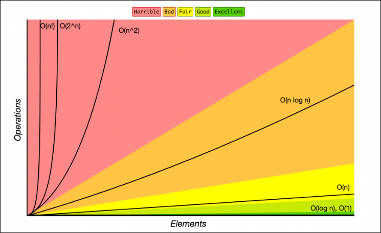

# Big-O notation
Is the language we use for talking about how long an algorithm takes to run.  

## O(n) -> Linear time
It's going to take as many operations as elements in the array.  
It takes linear time. Number of operations increases linearly.

## O(1) -> Constant time
The number of operations do not depend on the size of the input and are always constant.  

## Simplifying Big O (Rule Book)

### 1. Worst Case
Always think about the worst case when calculating Big O.

### 2. Remove constants
We have to remove the constants when doing the Big O calcutaion. We only care about what is on the chart.  
For example  
`O(1 + n/2 + 100) -> O(n)` -> Linear time.  
`O(2n) -> O(n)` -> Linear time.  
With Big O we don't really care about how steep the line is, we care about how the line moves as our input increases.

### 3. Different terms for inputs
When theres two ro more different inputs, the Big O adds, i mean, for input n, if you have a loop the Big O is `O(n)` and for a second loop for the second input (m) the Big O is `O(m)`, and cause you have two different loops for two different entries you add the two O notations -> `O(n) + O(m) = O(n + m)`.  

In this case, if we have a nested loop for two different inputs we multiply `O(n * m)`.
### 4. Drop non dominants
We only keep the most important (time consuming) notation.  
For example we have `O(n + n^2)` in this case the most time consuming notation is `O(n^2)`, so we drop `O(n)` and only keep `O(n)`.

## O(n^2) -> Quadratic time
Every time the number of elements increase it multiplies for itself to get the number of operations.  
For example, we have a nested loop for an array of three elememts instead of doing 3 operations, we do 9 operations, for 4 elements we do 16 and so.  
Cause we have `O(n * n) -> O(n^2)`.  
It is pretty slow. 
